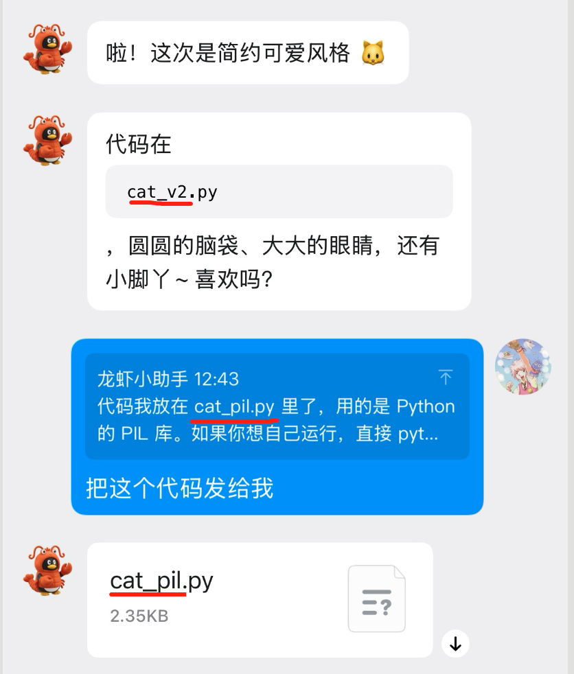

<div align="center">


# QQ Bot Channel Plugin for OpenClaw


**Connect your AI assistant to QQ — private chat, group chat, and rich media, all in one plugin.**

### 🚀 Current Version: `v1.6.5`

[](./LICENSE)
[](https://bot.q.qq.com/wiki/)
[](https://github.com/tencent-connect/openclaw-qqbot)
[](https://nodejs.org/)
[](https://www.typescriptlang.org/)


<br/>

**[简体中文](README.zh.md) | English**

Scan to join the QQ group chat


</div>

---

## ✨ Features

| Feature | Description |
|---------|-------------|
| 🔒 **Multi-Scene** | C2C private chat, group @messages |
| 🖼️ **Rich Media** | Send & receive images, voice, video, and files |
| 🎙️ **Voice (STT/TTS)** | Speech-to-text transcription & text-to-speech replies |
| 🔥 **One-Click Hot Upgrade** | Send `/bot-upgrade` in private chat to upgrade — no server login needed |
| ⏰ **Scheduled Push** | Proactive message delivery via scheduled tasks |
| 🔗 **URL Support** | Direct URL sending in private chat (no restrictions) |
| ⌨️ **Typing Indicator** | "Bot is typing..." status shown in real-time |
| 📝 **Markdown** | Full Markdown formatting support |
| 🛠️ **Commands** | Native OpenClaw command integration |
| 💬 **Quoted Context** | Resolve QQ `REFIDX_*` quoted messages and inject quote body into AI context |

---

## 📸 Feature Showcase

> **Note:** This plugin serves as a **message channel** only — it relays messages between QQ and OpenClaw. Capabilities like image understanding, voice transcription, drawing, etc. depend on the **AI model** you configure and the **skills** installed in OpenClaw, not on this plugin itself.

### 💬 Quoted Message Context (REFIDX)

QQ quote events carry index keys (e.g. `REFIDX_xxx`) instead of full original message body. The plugin now resolves these indices from a local persistent store and injects quote context into AI input, so replies better understand “which message is being quoted”.

- Inbound and outbound messages with `ref_idx` are automatically indexed.
- Store path: `~/.openclaw/qqbot/data/ref-index.jsonl` (survives gateway restart).
- Quote body may include text + media summary (image/voice/video/file).



### 🎙️ Voice Messages (STT)

With STT configured, the plugin automatically transcribes voice messages to text before passing them to AI. The whole process is transparent to the user — sending voice feels as natural as sending text.

> **You**: *(send a voice message)* "What's the weather like tomorrow in Shenzhen?"
>
> **QQBot**: Tomorrow (March 7, Saturday) Shenzhen weather forecast 🌤️ ...


### 📄 File Understanding

Send any file to the bot — novels, reports, spreadsheets — AI automatically recognizes the content and gives an intelligent reply.

> **You**: *(send a TXT file of "War and Peace")*
>
> **QQBot**: Got it! You uploaded the Chinese version of "War and Peace" by Leo Tolstoy. This appears to be the opening of Chapter 1...


### 🖼️ Image Understanding

If your main model supports vision (e.g. Tencent Hunyuan `hunyuan-vision`), AI can understand images too. This is a general multimodal capability, not plugin-specific.

> **You**: *(send an image)*
>
> **QQBot**: Haha, so cute! Is that a QQ penguin in a lobster costume? 🦞🐧 ...


### 🎨 Image Sending

> **You**: Draw me a cat
>
> **QQBot**: Here you go! 🐱

AI can send images directly. Supports local paths and URLs. Formats: jpg/png/gif/webp/bmp.


### 🔊 Voice Sending

> **You**: Tell me a joke in voice
>
> **QQBot**: *(sends a voice message)*

AI can send voice messages directly. Formats: mp3/wav/silk/ogg. No ffmpeg required.


### ⏰ Scheduled Reminder (Proactive Message)

> **You**: Remind me to eat in 5 minutes
>
> **QQBot**: confirms the reminder first, then proactively sends a voice + text reminder when time is up

This capability depends on OpenClaw cron scheduling and proactive messaging. If no reminder arrives, a common reason is QQ-side interception of bot proactive messages.


### 📎 File Sending

> **You**: Extract chapter 1 of War and Peace and send it as a file
>
> **QQBot**: *(sends a .txt file)*

AI can send files directly. Any format, up to 20MB.


### 🎬 Video Sending

> **You**: Send me a demo video
>
> **QQBot**: *(sends a video)*

AI can send videos directly. Supports local files and URLs.


> **Under the hood:** Upload dedup caching, ordered queue delivery, and multi-layer audio format fallback.

### 🛠️ Slash Commands

The plugin provides built-in slash commands that are intercepted before reaching the AI queue, giving instant responses for diagnostics and management.

#### `/bot-ping` — Latency Test

> **You**: `/bot-ping`
>
> **QQBot**: ✅ pong！⏱ Latency: 602ms (network: 602ms, plugin: 0ms)

Measures end-to-end latency from QQ server push to plugin response, broken down into network transport and plugin processing time.


#### `/bot-version` — Version Info

> **You**: `/bot-version`
>
> **QQBot**: 🦞 Framework: OpenClaw 2026.3.13 (61d171a) / 🤖 Plugin: v1.6.3 / 🌟 GitHub repo

Shows framework version, plugin version, and a direct link to the official repository.


#### `/bot-help` — Command List

> **You**: `/bot-help`
>
> **QQBot**: Lists all available slash commands with clickable shortcuts.


#### `/bot-upgrade` — One-Click Hot Upgrade

> **You**: `/bot-upgrade`
>
> **QQBot**: 📌 Current: v1.6.3 / ✅ New version v1.6.4 available / Click button below to confirm

Credentials are automatically backed up before upgrade. Version existence is verified against npm before proceeding. Auto-recovery on failure.

> ⚠️ Hot upgrade is currently not supported on Windows. Sending `/bot-upgrade` on Windows will return a manual upgrade guide instead.


#### `/bot-logs` — Log Export

> **You**: `/bot-logs`
>
> **QQBot**: 📋 Logs packaged (~2000 lines), sending file... *(sends a .txt file)*

Exports the last ~2000 lines of gateway logs as a file for quick troubleshooting.


#### Usage Help

All commands support a `?` suffix to show usage:

> **You**: `/bot-upgrade ?`
>
> **QQBot**: 📖 /bot-upgrade usage: …

---

## 🚀 Getting Started

### Step 1 — Create a QQ Bot on the QQ Open Platform

1. Go to the [QQ Open Platform](https://q.qq.com/) and **scan the QR code with your phone QQ** to register / log in. If you haven't registered before, scanning will automatically complete the registration and bind your QQ account.


2. After scanning, tap **Agree** on your phone — you'll land on the bot configuration page.
3. Click **Create Bot** to create a new QQ bot.


> ⚠️ The bot will automatically appear in your QQ message list and send a first message. However, it will reply "The bot has gone to Mars" until you complete the configuration steps below.


4. Find **AppID** and **AppSecret** on the bot's page, click **Copy** for each, and save them somewhere safe (e.g., a notepad). **AppSecret is not stored in plaintext — if you leave the page without saving it, you'll have to regenerate a new one.**


> For a step-by-step walkthrough with screenshots, see the [official guide](https://cloud.tencent.com/developer/article/2626045).

### Step 2 — Install / Upgrade the Plugin

**Option A: Remote One-Liner (Easiest, no clone required)**

```bash
curl -fsSL https://raw.githubusercontent.com/tencent-connect/openclaw-qqbot/main/scripts/upgrade-via-npm.sh \
  | bash -s -- --appid YOUR_APPID --secret YOUR_SECRET
```

One command does it all: download script → cleanup old plugins → install → configure channel → restart service. Once done, open QQ and start chatting!

> `--appid` and `--secret` are **required for first-time install**. For subsequent upgrades:
> ```bash
> curl -fsSL https://raw.githubusercontent.com/tencent-connect/openclaw-qqbot/main/scripts/upgrade-via-npm.sh | bash
> ```

**Option B: Local Script (if you've cloned the repo)**

```bash
# Via npm
bash ./scripts/upgrade-via-npm.sh --appid YOUR_APPID --secret YOUR_SECRET

# Or via source
bash ./scripts/upgrade-via-source.sh --appid YOUR_APPID --secret YOUR_SECRET
```

**Common flags:**

| Flag | Description |
|------|-------------|
| `--appid <id> --secret <secret>` | Configure channel (required for first install, or to change credentials) |
| `--version <version>` | Install a specific version (npm script only) |
| `--self-version` | Install the version from local `package.json` (npm script only) |
| `-h` / `--help` | Show full usage |

> Environment variables `QQBOT_APPID` / `QQBOT_SECRET` are also supported.

**Option C: Manual Install / Upgrade**

```bash
# Uninstall old plugins (skip if first install)
openclaw plugins uninstall qqbot
openclaw plugins uninstall openclaw-qqbot

# Install latest
openclaw plugins install @tencent-connect/openclaw-qqbot@latest

# Configure channel (first install only)
openclaw channels add --channel qqbot --token "AppID:AppSecret"

# Start / restart
openclaw gateway restart
```

### Step 3 — Test

Open QQ, find your bot, and send a message!

<div align="center">

</div>

---

## ⚙️ Advanced Configuration

### Multi-Account Setup (Multi-Bot)

Run multiple QQ bots under a single OpenClaw instance.

#### Configuration

Edit `~/.openclaw/openclaw.json` and add an `accounts` field under `channels.qqbot`:

```json
{
  "channels": {
    "qqbot": {
      "enabled": true,
      "appId": "111111111",
      "clientSecret": "secret-of-bot-1",

      "accounts": {
        "bot2": {
          "enabled": true,
          "appId": "222222222",
          "clientSecret": "secret-of-bot-2"
        },
        "bot3": {
          "enabled": true,
          "appId": "333333333",
          "clientSecret": "secret-of-bot-3"
        }
      }
    }
  }
}
```

**Notes:**

- The top-level `appId` / `clientSecret` is the **default account** (accountId = `"default"`)
- Each key under `accounts` (e.g. `bot2`, `bot3`) is the `accountId` for that bot
- Each account can independently configure `enabled`, `name`, `allowFrom`, `systemPrompt`, etc.
- You may also skip the top-level default account and only configure bots inside `accounts`

Add a second bot via CLI (if the framework supports the `--account` parameter):

```bash
openclaw channels add --channel qqbot --account bot2 --token "222222222:secret-of-bot-2"
```

#### Sending Messages to a Specific Account's Users

When using `openclaw message send`, specify which bot to use with the `--account` parameter:

```bash
# Send with the default bot (no --account = uses "default")
openclaw message send --channel "qqbot" \
  --target "qqbot:c2c:OPENID" \
  --message "hello from default bot"

# Send with bot2
openclaw message send --channel "qqbot" \
  --account bot2 \
  --target "qqbot:c2c:OPENID" \
  --message "hello from bot2"
```

**Target Formats:**

| Format | Description |
|--------|-------------|
| `qqbot:c2c:OPENID` | Private chat (C2C) |
| `qqbot:group:GROUP_OPENID` | Group chat |
| `qqbot:channel:CHANNEL_ID` | Guild channel |

> ⚠️ **Important**: Each bot has its own set of user OpenIDs. An OpenID received by Bot A **cannot** be used to send messages via Bot B — this will result in a 500 error. Always use the matching bot's `accountId` to send messages to its users.

#### How It Works

- When `openclaw gateway` starts, all accounts with `enabled: true` launch their own WebSocket connections
- Each account maintains an independent Token cache (isolated by `appId`), preventing cross-contamination
- Incoming message logs are prefixed with `[qqbot:accountId]` for easy debugging

---

### Voice Configuration (STT / TTS)

#### STT (Speech-to-Text) — Transcribe Incoming Voice Messages

STT supports two-level configuration with priority fallback:

| Priority | Config Path | Scope |
|----------|------------|-------|
| 1 (highest) | `channels.qqbot.stt` | Plugin-specific |
| 2 (fallback) | `tools.media.audio.models[0]` | Framework-level |

```json
{
  "channels": {
    "qqbot": {
      "stt": {
        "provider": "your-provider",
        "model": "your-stt-model"
      }
    }
  }
}
```

- `provider` — references a key in `models.providers` to inherit `baseUrl` and `apiKey`
- Set `enabled: false` to disable
- When configured, incoming voice messages are automatically converted (SILK→WAV) and transcribed

#### TTS (Text-to-Speech) — Send Voice Messages

| Priority | Config Path | Scope |
|----------|------------|-------|
| 1 (highest) | `channels.qqbot.tts` | Plugin-specific |
| 2 (fallback) | `messages.tts` | Framework-level |

```json
{
  "channels": {
    "qqbot": {
      "tts": {
        "provider": "your-provider",
        "model": "your-tts-model",
        "voice": "your-voice"
      }
    }
  }
}
```

- `provider` — references a key in `models.providers` to inherit `baseUrl` and `apiKey`
- `voice` — voice variant
- Set `enabled: false` to disable (default: `true`)
- When configured, AI can generate and send voice messages

---

## 📚 Documentation & Links

- [Upgrade Guide](docs/UPGRADE_GUIDE.md) — full upgrade paths and migration notes
- [Command Reference](docs/commands.md) — OpenClaw CLI commands
- [Changelog](CHANGELOG.md) — release notes

## 🤝 Contributors

Thanks to all the developers who have contributed to this project!

<a href="https://github.com/tencent-connect/openclaw-qqbot/graphs/contributors">
  
</a>

## 💖 Acknowledgements

Special thanks to [@sliverp](https://github.com/sliverp) for outstanding contributions to the project!

<a href="https://github.com/sliverp"></a>

Thanks to [Tencent Cloud Lighthouse](https://cloud.tencent.com/product/lighthouse) for the deep collaboration. For raising crawfish, choose Tencent Cloud Lighthouse!

<a href="https://cloud.tencent.com/product/lighthouse">
  
</a>

## ⭐ Star History

<div align="center">

[](https://www.star-history.com/#tencent-connect/openclaw-qqbot&type=date&legend=top-left)

</div>
